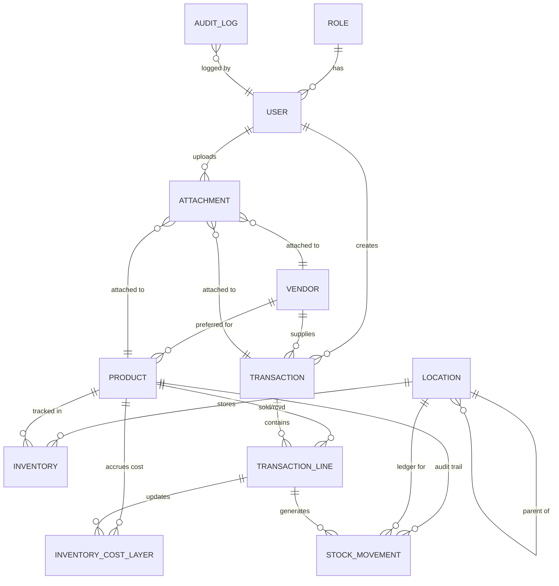

# Inventory System: Database Architecture Documentation

## 1. Overview
This document outlines the production-grade database architecture for the Inventory Management System. The design prioritizes **data integrity**, **auditability**, and **flexible costing methods** (FIFO, LIFO, Average).

---

## 2. Core Modules

### 2.1 Identity, Access Management & Partners
*   **`roles`**: Defines system access levels (`admin`, `staff`, `user`).
*   **`vendors`**: External partners supplying goods. Tracks contact info, address, and tax ID.
*   **`users`**: Extended profile including `is_active` flag, last login IP, and device tracking.
*   **`sessions`**: Production-ready session storage with parsed device info (`device_type`, `browser`, `platform`) and admin-driven termination support (`is_admin_terminated`).

### 2.2 Product Catalog
*   **`products`**: Master record for items. Stores `product_code`, `sku`, `barcode`, and reorder point/quantity.
*   **`costing_method`**: Per-product selection of `fifo`, `lifo`, or `average`.
*   **`categories`**: Nested categorization support using `parent_id`.
*   **`units_of_measure`**: Standardized units (pcs, kg, bx).
*   **`product_images`**: Support for multiple images with a `primary` flag.

### 2.3 Locations & Inventory Ledger
*   **`locations`**: Hierarchical warehouse management (Warehouse > Zone > Bin).
*   **`inventories`**: The real-time "Stock on Hand" ledger per product-location pair.
*   **`inventory_cost_layers`**: **CRITICAL** table for accounting. Records every receipt of stock with its unit cost. Transactions consume these layers based on the selected costing method.

### 2.4 Transactions
*   **`transactions`**: High-level stock events (Receipt, Issue, Transfer, Adjustment). Includes status control (`draft`, `pending`, `posted`, `cancelled`).
*   **`transaction_lines`**: Detailed line items including cost and selling price snapshots at the time of the event.

### 2.5 Stock Movement Ledger
*   **`stock_movements`**: **The Immutable Ledger**. This is the flat record of every stock change. Unlike transaction lines, this table explicitly records `in` and `out` movements for each location. It is the primary source for rebuilding inventory state and auditing.

---

## 3. Inventory Costing Methodologies

The system natively supports three major accounting methods:

### Weighted Average (AVCO)
*   **Mechanism**: The system maintain a running average in `products.average_cost` and `inventories.average_cost`.
*   **Calculation**: `(Current Stock Value + New Stock Value) / (Current Qty + New Qty)`.

### First-In, First-Out (FIFO)
*   **Mechanism**: Issues (sales) consume stock from the *oldest* unexhausted `inventory_cost_layers` first.
*   **Benefit**: Most accurate for tax purposes and perishables.

### Last-In, First-Out (LIFO)
*   **Mechanism**: Issues (sales) consume stock from the *newest* unexhausted `inventory_cost_layers` first.
*   **Use-case**: Standard for specific industrial accounting models.

---

## 4. Audit & Reliability

### 4.1 Audit Logs (The "Paper Trail")
*   **`audit_logs`**: An immutable, append-only table.
*   **Content**: Stores `old_values` and `new_values` as JSON strings for every record change.
*   **Context**: captures `user_id`, `ip_address`, `user_agent`, and the request `url`.

### 4.2 Stock Snapshots
*   **`stock_snapshots`**: Captured daily or on-demand.
*   **Purpose**: Provides "Point-in-Time" reporting. You can generate a valuation report for December 31st even if stocks have moved since then.

### 4.3 General Attachments
*   **`attachments`**: Polymorphic table allowing any entity (Product, Transaction, Vendor) to have multiple file uploads.
*   **Supported types**: PDFs, images, Excel sheets, and certificates.


---

## 5. ER Diagram (Conceptual)



---


---

## 7. Inventory Integrity Protocol

To prevent **Data Drift** (where transactions disagree with `quantity_on_hand`), the following architectural guardrails are strictly enforced:

### 7.1 Transactional atomicity (Option A)
The `inventories.quantity_on_hand` field is treated as a **denormalized cache** of the transaction history. 
*   **NEVER** manually update `inventories` or `inventory_cost_layers`.
*   **ALL** changes must occur within an Eloquent **`DB::transaction()`** block.
*   The system must use **Pessimistic Locking** (`SELECT FOR UPDATE`) on the `inventories` row before calculating the new total.

### 7.2 The "Rule of Four" (Alignment)
Every stock movement (Receipt, Issue, Transfer) must update four distinct sources of truth simultaneously:
1.  **`transactions` / `transaction_lines`**: The business event history.
2.  **`stock_movements`**: The immutable, flat movement ledger (Audit Trail).
3.  **`inventories`**: The real-time "Stock on Hand" cache.
4.  **`inventory_cost_layers`**: The accounting-grade cost pool (FIFO/LIFO).

### 7.3 Nightly Reconciliation (The "Self-Heal")
A scheduled background job (e.g., `VerifyInventoryIntegrity`) runs nightly to:
1.  Calculate `SUM(stock_movements.quantity)` (net balance) per product/location.
2.  Calculate `SUM(inventory_cost_layers.remaining_qty)` per product/location.
3.  Compare both against `inventories.quantity_on_hand`.
4.  If a mismatch is found, it logs the error in **`reconciliation_logs`** and sends an **Admin Alert**.

### 7.4 Transaction Integrity Rules (CRITICAL)
Beyond standard foreign keys, the system enforces business logic via Database `CHECK` constraints and Model-level validation:
*   **Transfers**: Must have both `from_location_id` AND `to_location_id`.
*   **Receipts**: Must have a `vendor_id`.
*   **Issues**: Must NOT have a `vendor_id` (enforce direct sale/usage).

---

## 8. Setup & Maintenance

### Running Migrations
```bash
php artisan migrate --force
```

### Initial Data Setup
```bash
php artisan db:seed --force
```

### Report Generation
*   **Engine**: Reports are defined in the `reports` table.
*   **Execution**: Report generation should be offloaded to queues, with results tracked in `report_runs`.

---

> [!IMPORTANT]
> **Data Integrity Rule**: Never manually edit `inventories` or `inventory_cost_layers`. Always use a `Transaction` entity to ensure the ledger and audit trail remain synchronized.

