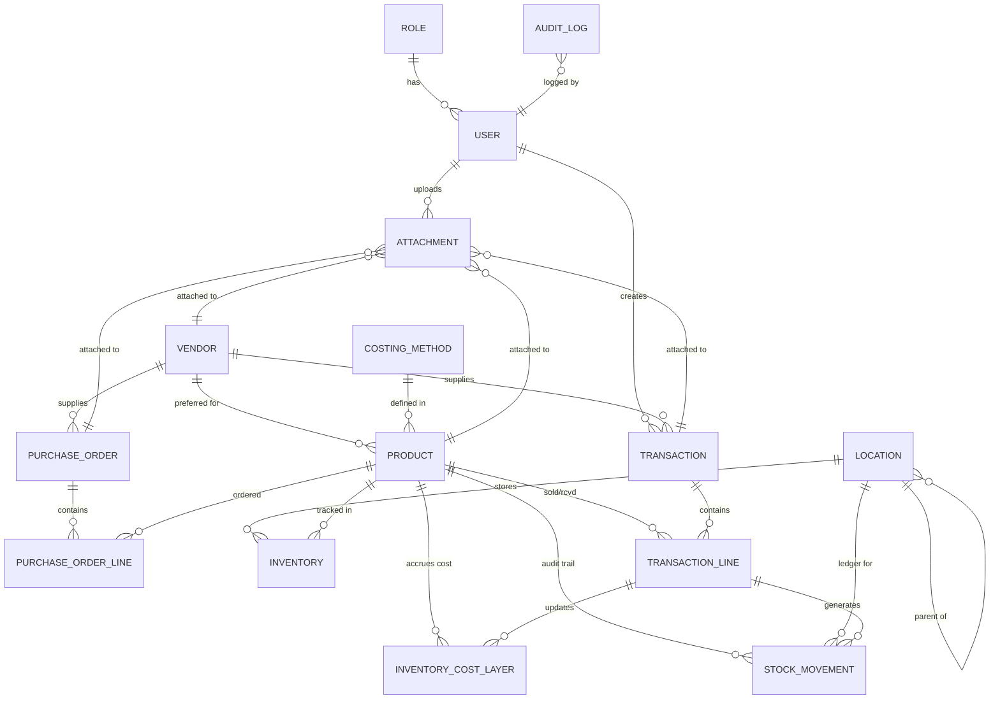

# Database Documentation

## Purpose
This document describes how the database in this inventory system is structured, operated, and maintained across development and production environments.

It is intended for developers, QA, and operations teams.

## Scope
- Database architecture and domain modules
- Environment configuration
- Migration and seeding workflow
- Data integrity and safety rules
- Performance practices
- Backup, restore, and incident response
- Production readiness checklist

## Technology Context
- Framework: Laravel
- Primary database: MySQL (local and expected production target)
- Migration system: Laravel migrations
- Seed system: Laravel seeders

## Domain Model Overview
The schema supports a full inventory lifecycle:

- Master data: users, products, locations, vendors, customers
- Movements: transactions and transaction lines
- Costing: inventory cost layers and costing methods
- Procurement: purchase orders and related statuses
- Sales: sales orders and fulfillment linkage
- Traceability: serials, batches/lots, attachments, audit logs
- Planning and pricing: replenishment, price lists, discount rules
- Logistics: shipment and carrier-related records
- Access control: permissions and role mappings

## Database Design Standards
- Use foreign keys for all relational dependencies.
- Default to `restrictOnDelete` for critical accounting/stock history relations.
- Use `cascadeOnDelete` only for purely dependent child entities.
- Enforce positive quantity and other invariant checks where possible.
- Avoid destructive schema changes in a single release without a rollback-safe path.
- Prefer additive migrations (new columns/tables) before deprecating old ones.

## Environment Configuration
Use environment-specific `.env` values.

### Development
- `APP_ENV=local`
- `APP_DEBUG=true`
- Non-production credentials
- Local database instance

### Staging
- `APP_ENV=staging`
- `APP_DEBUG=false`
- Staging-only credentials
- Production-like data volume for load tests

### Production
- `APP_ENV=production`
- `APP_DEBUG=false`
- Least-privilege DB user (never app runtime as root)
- Strong password rotation policy
- TLS-enabled DB transport where supported

## Local Setup and Bootstrap
1. Install dependencies.
2. Configure `.env` for local database.
3. Run migrations.
4. Run seeders.
5. Execute tests.

Typical commands:
- `php artisan migrate`
- `php artisan db:seed`
- `php artisan test`

## Migration Workflow
### Rules
- One logical change per migration.
- Name migrations clearly by intent.
- Always implement both `up()` and `down()`.
- Avoid writing high-risk data transformations without backups.
- Validate migration order on a clean database before merge.

### Pull Request Expectations
- Include migration rationale.
- Include rollback behavior.
- Include query/index impact notes for large tables.
- Include test updates if business rules changed.

## Seeding Strategy
- Keep seeders deterministic for repeatable development setup.
- Separate reference seeders (statuses/types) from sample/test data.
- Ensure seeders can run multiple times safely when possible.

## Data Integrity Policy
- Inventory-affecting writes must be transactional.
- Posting operations must be idempotent to prevent duplicate stock effects.
- Every stock movement should have an audit trail.
- Soft deletes should not break stock and cost history references.
- Status transitions must follow an explicit lifecycle matrix.

## Performance and Scaling Guidelines
- Monitor and tune top read/write queries first.
- Add composite indexes based on query patterns, not guesswork.
- Use pagination on high-volume list endpoints.
- Run explain plans for slow queries before schema updates.
- Reassess index strategy after major feature additions.

## Observability and Monitoring
Track at minimum:
- Query latency (P50/P95/P99)
- Slow query count and offenders
- Active connections and saturation
- Lock waits and deadlocks
- Error rates for transaction posting paths

Set alerts for:
- Failed backups
- Long-running migrations
- Deadlock spikes
- Connection pool exhaustion

## Backup and Recovery
### Policy
- Scheduled full backups
- Incremental/binlog backups if supported
- Retention policy by compliance and recovery needs

### Validation
- Perform regular restore drills into a clean environment.
- Measure and document:
  - RPO (data loss tolerance)
  - RTO (recovery time target)

### Minimum Runbook
- Who triggers restore
- Which backup source to use
- Verification steps post-restore
- Communication protocol for incidents

## Release and Change Management
- Apply migrations first in staging, then production.
- Take pre-release backup snapshot.
- Use maintenance/cutover window for high-risk migrations.
- Validate critical business flows immediately after deployment:
  - PO receiving
  - SO posting
  - stock movement reports
  - cost layer updates

## Security Controls
- Never commit secrets in repository files.
- Restrict DB account permissions to required schema actions.
- Rotate credentials on schedule and after incidents.
- Review access logs and privilege grants periodically.

## Testing Strategy
- CI must run migrations from scratch and execute feature tests.
- Add regression tests for each inventory bug fix.
- Include concurrency tests for stock posting and consumption.
- Include data integrity tests for invariant checks.

## Production Readiness Checklist
- [ ] `APP_ENV` and debug settings are production-safe.
- [ ] Application uses non-root least-privilege DB credentials.
- [ ] All migrations pass on a clean staging clone.
- [ ] Backup and restore drill completed successfully.
- [ ] Slow query and deadlock alerts are active.
- [ ] Core inventory lifecycle tests pass in CI and staging.
- [ ] Rollback and incident runbooks are documented and rehearsed.

## Ownership and Maintenance
- Engineering owns schema evolution and migration quality.
- QA owns integration and regression verification.
- Operations owns backup, restore, monitoring, and alerts.
- Review this document at least once per quarter or after major schema changes.
# Inventory System: Database Architecture Documentation

## 1. Overview
This document outlines the production-grade database architecture for the Inventory Management System. The design prioritizes **data integrity**, **auditability**, and **flexible costing methods** (FIFO, LIFO, Average).

---

## 2. Core Modules

### 2.1 Identity, Access Management & Partners
*   **`roles`**: Defines system access levels (`admin`, `staff`, `user`).
*   **`vendors`**: External partners supplying goods. Tracks contact info, address, and tax ID.
*   **`users`**: Extended profile including `is_active` flag, last login IP, and device tracking.
*   **`sessions`**: Production-ready session storage with parsed device info (`device_type`, `browser`, `platform`) and admin-driven termination support (`is_admin_terminated`).

### 2.2 Product Catalog
*   **`products`**: Master record for items. Stores `product_code`, `sku`, `barcode`, and reorder point/quantity.
*   **`costing_method_id`**: Reference to the **`costing_methods`** lookup table. Supports `fifo`, `lifo`, or `average`.
*   **`categories`**: Nested categorization support using `parent_id`.
*   **`units_of_measure`**: Standardized units (pcs, kg, bx). Supports soft deletes.
*   **`product_images`**: Support for multiple images with a `primary` flag (now largely integrated into the polymorphic **`attachments`** system).

### 2.3 Locations & Inventory Ledger
*   **`locations`**: Hierarchical warehouse management (Warehouse > Zone > Bin). Linked to **`location_types`**.
*   **`inventories`**: The real-time "Stock on Hand" ledger per product-location pair.
    *   **Guard**: Database-level `CHECK` constraint prevents `quantity_on_hand` from falling below zero (`chk_inventory_qty_non_negative`).
*   **`inventory_cost_layers`**: **CRITICAL** table for accounting. Records every receipt of stock with its unit cost.
    *   **Auto-Calculation**: The `remaining_qty` is a **Database Generated Column** (`received_qty - issued_qty`). This ensures it never drifts from actual receipts and issues.
    *   **Guard**: Database-level `CHECK` constraints ensure `received_qty > 0`.

### 2.4 Transactions
*   **`lookup_tables`**: **MODERNIZED** architecture replaces ENUMs with dedicated tables for high extensibility:
    *   **`transaction_types`**: Receipt, Issue, Transfer, Adjustment, Opening Balance.
    *   **`transaction_statuses`**: Draft, Pending, Posted, Cancelled.
    *   **`location_types`**: Warehouse, Zone, Aisle, Bin.
    *   **`costing_methods`**: FIFO, LIFO, Weighted Average.
*   **`transactions`**: High-level stock events. Linked to types and statuses via Foreign Keys.
*   **Reference Traceability:** Includes `purchase_order_id` to link arrivals back to the procurement stage.
*   **`transaction_lines`**: Detailed line items capturing `unit_cost`, `total_cost`, and a snapshot of the `costing_method_id` used for the movement.

---

### 2.5 Procurement (Purchase Orders)
*   **`purchase_orders`**: Formal ordering module for requesting stock from `vendors`.
*   **Tracking**: Includes `po_number`, `order_date`, `expected_delivery_date`, and `currency`.
*   **Lifecycle**: Managed via `purchase_order_statuses` (`draft`, `open`, `partially_received`, `closed`, `cancelled`).
*   **Approval**: Supports multi-stage workflows with `approved_by` and `approved_at` timestamps.
*   **`purchase_order_lines`**: Detailed line items tracking `ordered_qty` vs. `received_qty`.
    *   **Automation**: The `total_cost` is a database-level virtual column (`ordered_qty * unit_cost`).

### 2.6 Stock Movement Ledger
*   **`stock_movements`**: **The Immutable Ledger**. This is the flat record of every stock change. Unlike transaction lines, this table explicitly records `in` and `out` movements for each location. It is the primary source for rebuilding inventory state and auditing.

---

## 3. Inventory Costing Methodologies

The system natively supports three major accounting methods, managed via the `costing_methods` table:

### Weighted Average (AVCO)
*   **Mechanism**: The system maintains a running average in `products.average_cost` and `inventories.average_cost`.
*   **Calculation**: `(Current Stock Value + New Stock Value) / (Current Qty + New Qty)`.

### First-In, First-Out (FIFO)
*   **Mechanism**: Issues (sales) consume stock from the *oldest* unexhausted `inventory_cost_layers` first.
*   **Benefit**: Most accurate for tax purposes and perishables.

### Last-In, First-Out (LIFO)
*   **Mechanism**: Issues (sales) consume stock from the *newest* unexhausted `inventory_cost_layers` first.
*   **Use-case**: Standard for specific industrial accounting models.

---

## 4. Audit & Reliability

### 4.1 Audit Logs (The "Paper Trail")
*   **`audit_logs`**: An immutable, append-only table logging all changes.
*   **Content**: Stores `old_values` and `new_values` as JSON strings.
*   **Context**: captures `user_id`, `ip_address`, `user_agent`, and the request `url`.

### 4.2 Stock Snapshots
*   **`stock_snapshots`**: Captured daily or on-demand for "Point-in-Time" reporting.

### 4.3 General Attachments
*   **`attachments`**: Polymorphic table allowing any entity (Product, Transaction, Vendor) to have file uploads.

---

## 5. ER Diagram (Conceptual)



---


---

## 6. Reporting & Analytics

The system features a decoupled reporting engine that supports both on-demand and scheduled execution.

### 6.1 Report Engine
*   **`reports`**: Saved report definitions (templates). Stores `filters` (JSON), `type`, and `schedule_cron` for automation.
*   **Supported types**: `stock_on_hand`, `valuation`, `audit_trail`, `low_stock`, etc.
*   **`report_runs`**: Historical execution records. Captures the execution `status` (pending, processing, completed, failed), the user who ran it, and the final `file_path`.

### 6.2 Point-in-Time Analysis
*   **`stock_snapshots`**: Captured daily or on-demand to provide historical valuation and audits.

---

## 7. Inventory Integrity Protocol

To prevent **Data Drift** (where transactions disagree with `quantity_on_hand`), the following architectural guardrails are strictly enforced:

### 7.1 Transactional atomicity
*   **NEVER** manually update `inventories` or `inventory_cost_layers`.
*   **ALL** changes must occur within an Eloquent **`DB::transaction()`** block.
*   The system uses **Pessimistic Locking** (`SELECT FOR UPDATE`) on the `inventories` row before calculating the new total.

### 7.2 The "Rule of Four" (Alignment)
Every stock movement (Receipt, Issue, Transfer) must update four distinct sources of truth simultaneously:
1.  **`transactions` / `transaction_lines`**: The business event history.
2.  **`stock_movements`**: The immutable, flat movement ledger (Audit Trail).
3.  **`inventories`**: The real-time "Stock on Hand" cache.
4.  **`inventory_cost_layers`**: The accounting-grade cost pool (FIFO/LIFO).

### 7.3 Nightly Reconciliation (The "Self-Heal")
A scheduled background job (e.g., `VerifyInventoryIntegrity`) runs nightly to calculate discrepancies and log them in **`reconciliation_logs`**.

---

## 8. Setup & Maintenance

### Running Migrations
```bash
php artisan migrate --force
```

### Initial Data Setup
```bash
php artisan db:seed --force
```

---

> [!IMPORTANT]
> **Data Integrity Rule**: Never manually edit `inventories` or `inventory_cost_layers`. Always use a `Transaction` entity to ensure the ledger and audit trail remain synchronized.

